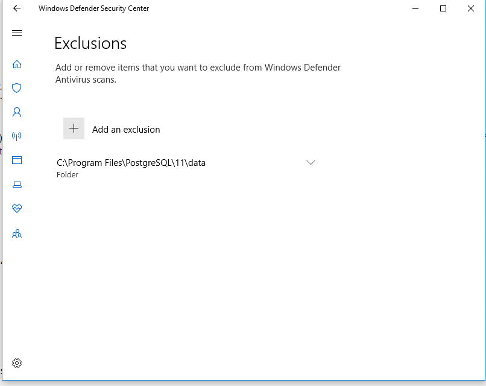
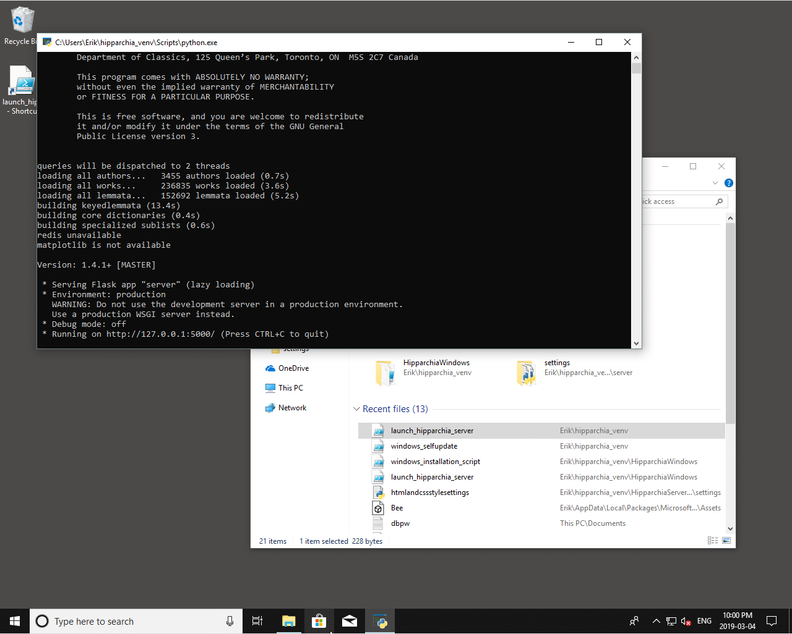

## GENERIC INSTALLATION OVERVIEW

### project overview

1. Top of repository:

    * https://github.com/e-gun
    
    **mirror:**
    * https://gitlab.com/e-gun/

1. Description + Pictures of what you get/what `Hipparchia` can do: (scroll all the way down through the page…)

	https://github.com/e-gun/HipparchiaServer

---
### installation summary

1.  To get started, first pick your OS:

	* https://github.com/e-gun/HipparchiaMacOS
	* https://github.com/e-gun/HipparchiaWindows
	* https://github.com/e-gun/HipparchiaNIX

1. Then you do what your OS install instructions say: 

	e.g: open Terminal.app and paste
	
	`curl https://raw.githubusercontent.com/e-gun/HipparchiaMacOS/master/automated_macOS_install.sh | /bin/bash`

    After watching a lot of messages fly by you will have the full framework. Its probably good news 
    if you see the following: `CONGRATULATIONS: You have installed the Hipparchia framework`

1. After you have installed the software framework, you need to load the data. 
    You either do what it says at

    **either**

	* https://github.com/e-gun/HipparchiaBuilder

    **or**

	* https://github.com/e-gun/HipparchiaSQLoader

    If you know somebody with a build, then you are interested in `HipparchiaSQLoader`.
    Your **reload** (via `reloadhipparchiaDBs.py`) the products of an 
    **extraction** (via `extracthipparchiaDBs.py`).  For example if A ran `extracthipparchiaDBs.py` and then put the `sqldump` folder on a thumb drive, 
    B could move that folder from the drive into his/her `HipparchiaData` folder and then run 
    `reloadhipparchiaDBs.py`. 

    Otherwise you need to build the databases yourself via `HipparchiaBuilder`.
    You put the data in the right place and then run `makecorpora.py`. 

1. Then you will have a working installation. Now it is time to use `HipparchiaServer`. You can `run.py` whenever you want. 
    Mac people even have a handy `launch_hipparchia.app` that can be clicked. 
    
    Once `HipparchiaServer` is running you launch a web browser and (by default) go to http://localhost:5000

    You can leave `HipparchiaServer` running forever, really: it only consumes an interesting 
    amount of computing resources when you execute queries. 
    
    The default settings should work well out of the box. Edit the files in `~/hipparchia_venv/HipparchiaServer/server/settings`
    if you want to change something. For example, `vectors` are off by default and someone who installs
    the proper `python` packages will want to edit `semanticvectorsettings.py` and set `SEMANTICVECTORSENABLED = 'yes'` 
    (and then check the list of vector search types to make sure everything desired has a `yes` next to it)

---

## Windows SPECIFIC INSTALLATION INFORMATION

files for installing Hipparchia on Windows

[in progress; but it works...]

users will need to pre-load several packages themselves:
1. [python](https://www.python.org/downloads/windows/)
1. [git](https://github.com/git-for-windows/git/releases/)
1. [7z](https://www.7-zip.org/download.html)
1. [postgresql](https://www.postgresql.org/download/windows/)
1. [redis](https://github.com/microsoftarchive/redis/releases/)

it is **critical** to choose `"C"` as the Locale when asked to by the
`postgresql` installer

you will need to pick a good, strong `password` for the user `postgres` 
when installing `postgresql`. Note it down for later because **you will enter this password 4x** when 
running the installation script.

the software also needs to be installed into the proper 
folders (should default to them, though):

    python: "C:\Users\$UNAME\AppData\Local\Programs\Python\Python3*\python.exe"
    git:    'C:\Program Files (x86)\Git\bin\git.exe'
    7z:     'C:\Program Files\7-zip\7z.exe'
    psql:   'C:\Program Files\PostgreSQL\*\bin\psql.exe'
    
At this point you are ready to **run the installer script** (`windows_installation_script.ps1`). 
The shell executing it requires 
`Set-ExecutionPolicy RemoteSigned`. 

In order to ensure that, you will 
need to set that policy via an `Administrator` shell.

**Building** entails `activate`-ing the `venv`. Edit `config.ini` 
as necessary and then...

    cd ~\hipparchia_venv\Scripts\
    .\activate
    cd ..\HipparchiaBuilder\
    ..\Scripts\python.exe -Xutf8 .\makecorpora.py
    
    [some time later...]
    cd ..\HipparchiaServer\
    ..\Scripts\python.exe .\run.py
    
    
**Vector** functions are not automatically installed. You need to:

    pip install cython scipy numpy gensim pyLDAvis matplotlib networkx scikit-learn

The `pip install...` command will only work if you `activate`-ed the `venv` as in **Building** above.

vectors will work if you can meet the requirements for installing `gensim`: sill more dependencies...: `building 'gensim.models.word2vec_inner' extension... error: Microsoft Visual C++ 14.0 or greater is required. Get it with "Microsoft C++ Build Tools": https://visualstudio.microsoft.com/visual-cpp-build-tools/` So go [grab](https://visualstudio.microsoft.com/visual-cpp-build-tools/) it... 

#### Troubleshooting cheatsheet

Gotchas as of `1.7.6`

1. you need to grab [golang](https://golang.org/doc/install) if you are going to build [HipparchiaGoDBHelper](https://github.com/e-gun/HipparchiaGoDBHelper)
1. if you do that you need [GCC](http://tdm-gcc.tdragon.net/download) too
1. loader from stored SQL in the builder has to call `psql.exe`, but that location is a moving target: `/Program Files/PostgreSQL/NN/bin/psql.exe` where NN might be `10`, `11`, `12`, `13`, ...: watch out for file not found errors.  [The generic `arguments.append('psql')` in `archivedsqlloader()` needs to `append` the proper windows-specific path.]
1. `--pgversion` command line option will let windows users try to to set the right path to `psql.exe`: `makecorpora.py --pgversion 11 ...`
1. there is a Windows-only pickling problem with multiprocessing (again), so the `HipparchiaGoDBHelper` is going to be your firend until something in the `1.7.6+` range addresses this. You need [HipparchiaGoBinaries](https://github.com/e-gun/HipparchiaGoBinaries) if building is not your thing. Note that searches via the helper are in theory going to be faster in any case.

Building / Loading / Debugging will be done in PowerShell

1. A shell with `administrator` privileges is often going to be required
1. `Set-ExecutionPolicy RemoteSigned` will usually need to be set before anything can happen
1. `~\hipparchia_venv\Scripts\activate` needs to be executed to get the right `python` interpreter
1. Only at this point will saying `python .\somescript.py` work
1. **Avoid** editing `config.ini` with `NotePad`. Unicode errors will ensue after you hit `save`. Consider using something smarter like `Sublime Text`.
1. If `7z`, `git`, etc. are installed under the 32-bit Programs directory the automated scripts will not find them

the Windows version of Hipparchia has been observed to be **far** slower than HipparchiaServer on other platforms. [but now `HipparchiaGoDBHelper` seems to be able to make up for all of the lost speed...]
But it is not always hopelessly slow on Windows.
Why some installations are slow is not yet clear. 

Some tips:
1. Windows Defender hates postgres; if you search 235k texts, Windows Defender will look at all of them first. Ick.
1. You can/should exclude the psql data files from being "defended" against. See the image below.
1. This will restore c. 50% of your missing search speed. The other 50% has not been tracked down yet.

What you will see if you launch succesfully

